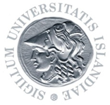
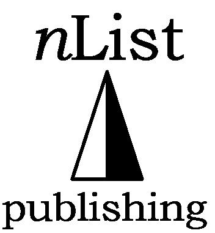
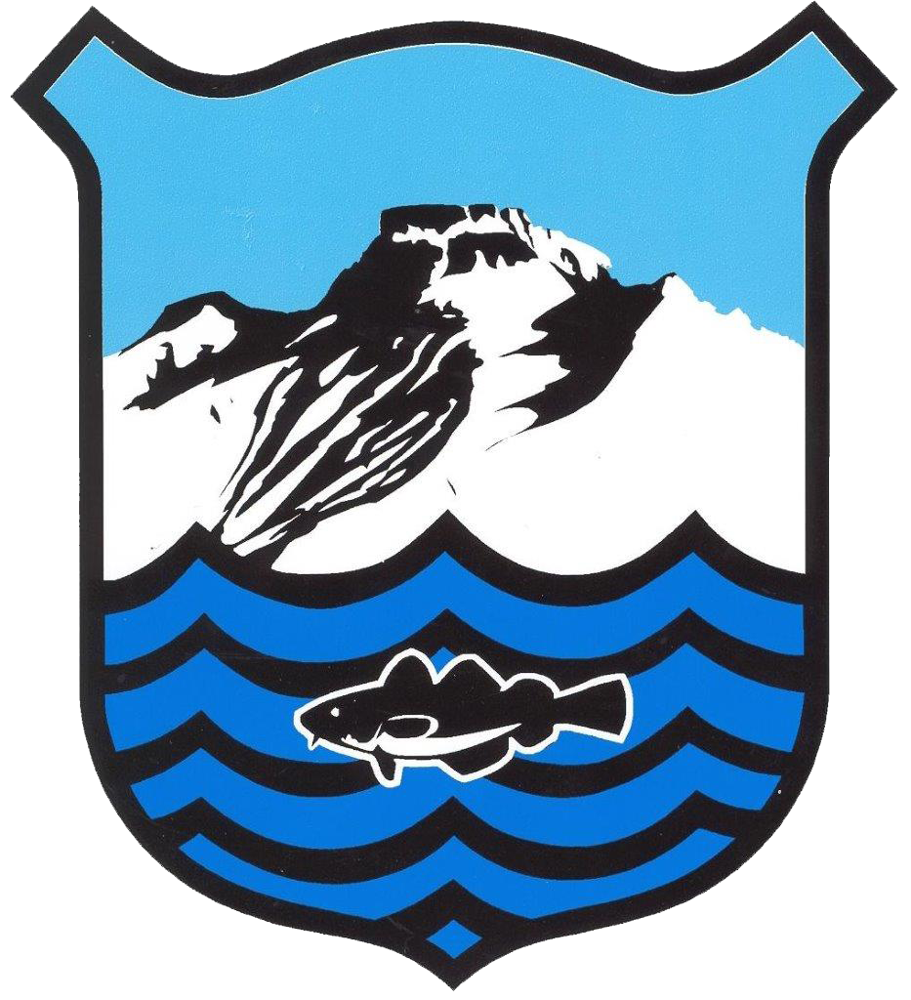

<html lang="en">
<h2> -- past and present </h2>
<bt> 
<head>
  <title>Table Logo</title>
    <meta charset="UTF-8">
    <meta name="viewport" content="width=device-width, initial-scale=1.0">
    <link rel="stylesheet" href="Styles.css">
</head>
<body>
  

<table class="table_affil">
  <tr>
    <th></th>
    <th></th>
    <th></th>
    <th></th>
    <th></th>
  </tr>
  </table>
</body>
  

* <b>nList Publishing,</b> <i>Chair of Board of Directors</i>
* <b>University of Iceland, Department of Biology,</b> <i>Member of Board</i> 
* <b>University of Iceland, Department of Biology, Educational Committee,</b> Member of Committee</i> 
* <b>Culture Committee of Skagastrond,</b> <i>Member of Committee</i> 
* <b>Health Board of the District of Kopavogur,</b> <i>Member of Board</i> 
* <b>Kopavogur College,</b> <i>Member of Board</i>
* <b>Association of University Teachers in Akureyri, Iceland,</b> <i>Member</i> 
* <b>Icelandic Confederation of University Graduates, Reykjavik, Iceland,</b> <i>Member</i> 
* <b>The Ecological Society of Iceland,</b> <i>Member</i> 
* <b>Nordic Lipidforum, Scandinavia,</b> <i>Member</i>
* <b>Park Ltd.,</b> <i>Member of Board of Directors</i> 
* <b>European funded projects on redfish and cod,</b> <i>Member of several Delegations</i> 
* <b>Icelandic Delegation on redfish stock structure at the International Council for the Exploration of the Sea (ICES),</b> <i>Member</i> 
* <b>Icelandic Delegation of Stock Identity and Management Units of Redfish (SGSIMUR), ICES,</b> <i>Member</i> 
  

<head>
  <title>Table Logo</title>
    <meta charset="UTF-8">
    <meta name="viewport" content="width=device-width, initial-scale=1.0">
    <link rel="stylesheet" href="Styles.css">
</head>
<body>
  

<table class="table_affil">
  <tr>
    <th></th>
    <th></th>
    <th></th>
    <th></th>
    <th></th>
  </tr>
  </table>
</body>
  

 <!-- Footer: -->
<html lang="en">
<head>
    <meta charset="UTF-8">
    <meta name="viewport" content="width=device-width, initial-scale=1.0">
    <link rel="stylesheet"          href="Styles.css">
    <title>My Website</title>
</head>
<body>
    <!-- Your website content goes here -->
    <footer>
          
<a href="mailto:mostinn@gmail.com"><b>Contact me!</b></a>

          
© 2024 Magnús Örn Stefánsson
 
    </footer>
</body>
</html>

