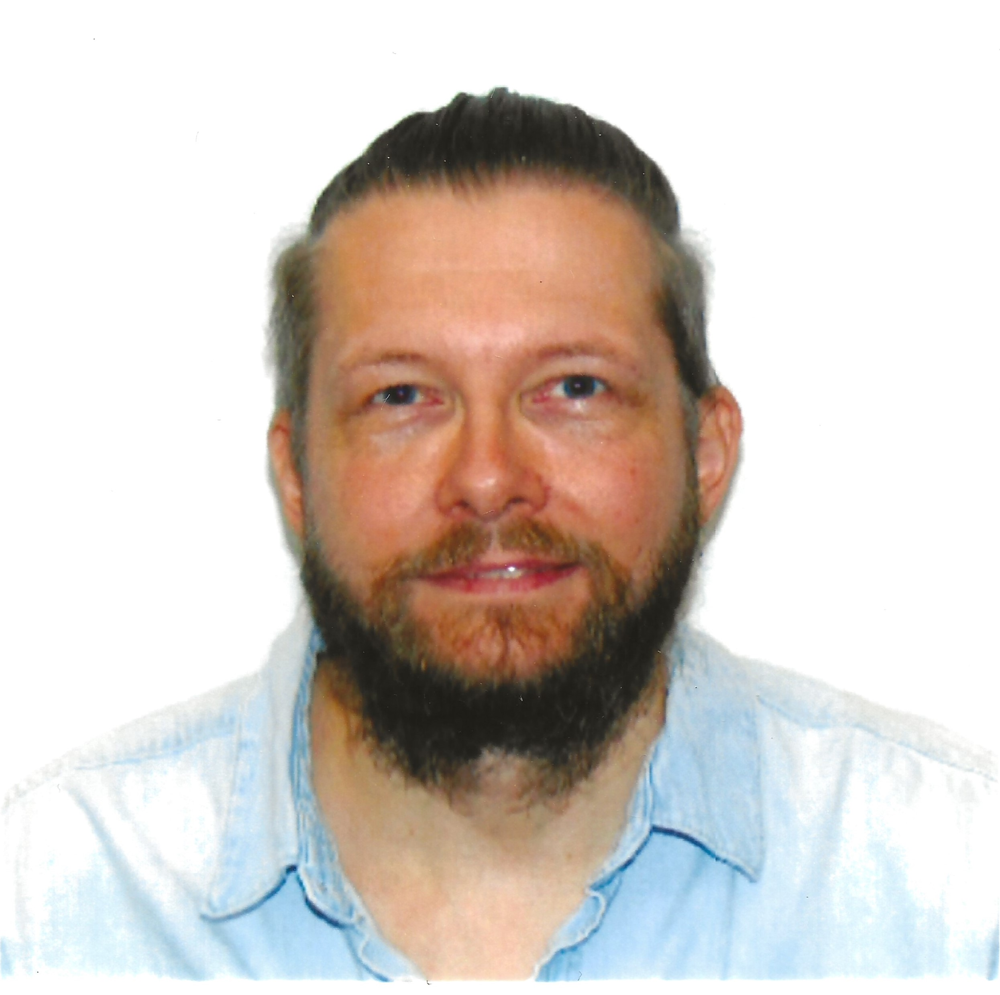
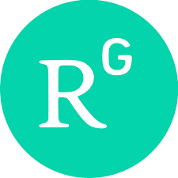

```{r setup, include=FALSE, echo=F, error=F}
library(knitr)
options(knitr.graphics.error = T)
knitr::opts_chunk$set(echo = TRUE, dpi=300,  fig.width=9.2, fig.height=6, fig.align="center")
#source("G:/My Drive/MagnusHA/R_scripts_Safn/sct_DoE_DataMan_Analysis_Plots_pakkar.R")
library(jpeg)
library(grid)
library(htmltools)
library(gridExtra)
library(png)
library(ggplot2)
library(unikn)
library(pdftools)
library(leaflet)
library(readxl)
library(tidyverse)
#install.packages(readxl)
#install.packages("leaflet")
#install.packages("tinytex")
#tinytex::install_tinytex(force = TRUE)
#library(webshot)
#webshot::install_phantomjs()
```

 <!-- Table with portrait and txt  -->
<html lang="en">
<head>
    <meta charset="UTF-8">
    <meta name="viewport" content="width=device-width, initial-scale=1.0">
</head>
<body>
    <table style="margin-left: auto; margin-right: auto; width: 80%">
        <tr>
            <th> I am a scientist and an entrepreneur with a Ph.D. in genetics and an Executive MBA in business management. I've has focused my career on different aspects of environmental sustainability, ranging from natural resource management to sustainable bioprocessing. My efforts have supported economic growth and created novel business opportunities.</th>
            <th>    </th>
        </tr>
    </table>
</body>
</html>

<!-- Table with social media links: -->
<html lang="en">
<head>
    <meta charset="UTF-8">
    <meta name="viewport" content="width=device-width, initial-scale=1.0">
</head>
<body>
    <table style="margin-left: auto; margin-right: auto; width: 30%">
        <tr>
            <th></th>
            <th>
</th>
            <th></th>
        </tr>
    </table>
</body>
</html>

<br></br>

<h1>Research around the world</h1>

```{r mapWorkLocals, echo=F, warning=F, out.width = "100%", out.height="500px", fig.align="center"}
# -----
ResearchAroundTheWorld_Data <- read_excel("SourceDocuments/ResearchAroundTheWorld-Data.xlsx")

ResearchAroundTheWorld_Data <- ResearchAroundTheWorld_Data%>%mutate(popup_ResearchAroundTheWorld=paste(Place, '</br>', Role, '</br>', '>', Responsibilities))

# Map in leaflet ----
mapWorkLocals <- leaflet() %>% 
   addProviderTiles(providers$Esri.WorldShadedRelief) %>%         #_https://leaflet-extras.github.io/leaflet-providers/preview/
  #addTiles() %>% 
  setView(lng = -15, lat = 50, zoom = 3) %>%
  addCircleMarkers(data = ResearchAroundTheWorld_Data, lat = ~Lat, lng = ~Lon, radius = ~7, popup  = ~popup_ResearchAroundTheWorld, color = "Black")
mapWorkLocals

```


<br></br>
 <!-- Footer: -->
<html lang="en">
<head>
    <meta charset="UTF-8">
    <meta name="viewport" content="width=device-width, initial-scale=1.0">
    <link rel="stylesheet" href="Styles.css">
    <title>My Website</title>
</head>
<body>
    <!-- Your website content goes here -->
    <footer>
          <p><a href="mailto:mostinn@gmail.com"><b>Contact me!</b></a></p>
          <p>© 2024 Magnús Örn Stefánsson</p> 
    </footer>
</body>
</html>


