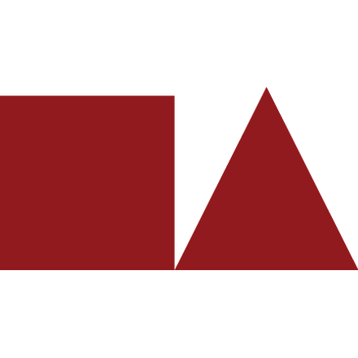
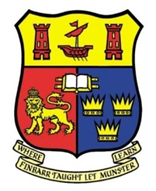

<html lang="en">

<h2>Experience</h2>
<head>
  <meta charset="UTF-8">
  <meta name="viewport" content="width=device-width, initial-scale=1.0">
  <title>Experience</title>
    <link rel="stylesheet" href="Styles.css">
</head>
<body>
  

  <table class="table_rsm">
    <tr>
      <td></td>
      <td>
        <b>Consulting Scientist,</b> nList; Sturbridge, MA
      </td>
    </tr>  
    <tr>
      <td></td>
      <td>
        <b>Managing Scientist,</b> Exponent Inc.; Natick, MA
      </td>
    </tr>
    <tr>
      <td></td>
      <td>
        <b>Research Manager,</b> Harvard University; Cambridge, MA
      </td>    
    </tr>
    <tr>
      <td></td>
      <td>
        <b>Founder and Managing Editor,</b> Iceview Magazine; Iceland
      </td>    
    </tr>
    <tr>
      <td></td>
      <td><b>Research Fellow,</b> University of Akureyri & BioPol Ltd.; Iceland</td>
    </tr>
    <tr>
      <td></td>
      <td><b>Chief Scientific Officer,</b> Biosensores, S.L.; Spain</td>    
    </tr>
    <tr>
      <td></td>
      <td><b>Project Manager,</b> Office of the CEO, National University Hospital; Iceland</td>    
    </tr>
    <tr>
      <td></td>
      <td><b>Senior Scientist / Interim Head of Laboratory,</b> Marine and Freshwater Research Institute; Iceland</td>    
    </tr>
    <tr>
      <td></td>
      <td><b>Research Associate,</b> University College Cork; Ireland</td>    
    </tr>
    </table>
</body>
  

<h2>Teaching and supervision<h2>
<h3>Undergraduate and postgraduate supervisor</h3>
<head>
    <link rel="stylesheet" href="Styles.css">
</head>
<body>
  

  <table class="table_rsm">
        <td></td>
          <td><b>University of Akureyri:</b> Marine biotechnology </td>
    </tr>
    <tr>
      <td></td>
        <td><b>University College Cork:</b> Aquaculture; molecular genetics </td>
    </tr>
</table>
<h3>Lectures</h3>
<table class="table_rsm">
  <tr>
    <td></td>
      <td><b>University of Akureyri:</b>  Biotechnology; evolution; sustainable resource management</td>
</tr>
<tr>
  <td></td>
    <td><b>University College Cork:</b> Aquaculture </td>
  </tr>
  <tr>
  <td></td>
    <td><b>Adult Education Institute of the North West Iceland:</b> Spanish for beginners </td>
  </tr>
</table>
</body>
  

<h2>Advice</h2>
<head>
    <link rel="stylesheet" href="Styles.css">
</head>
<body>
  

  <table class="table_rsm">
    <tr>
      <td></td>
      <td>
        <b>Government of Iceland,</b> 
         &ensp;&bull; Redfish (<i>Sebastes mentella</i> and <i>S. marinus</i>)
        </td>    
    </tr>
    <tr>
      <td></td>
      <td>
        <b>International Council for the Exploration of the Sea</b>
         &ensp;&bull; Redfish (<i>Sebastes mentella</i> and <i>S. marinus</i>)
        </td>    
    </tr>
    <tr>
      <td></td>
      <td>
        <b>International Whaling Commission</b>
         &ensp;&bull; Fin whale (<i>Balaenoptera physalus</i>) and minke whale (<i>Balaenoptera acutorostrata</i>)
        </td>    
    </tr>
    <tr>
      <td></td>
      <td>
        <b>North Atlantic Marine Mammal Commission</b>
         &ensp;&bull; Fin whale (<i>Balaenoptera physalus</i>)
        </td>    
    </tr>
    </table>
</body>
  

<h2>Education</h2>
<head>
    <link rel="stylesheet" href="Styles.css">
</head>
<body>
  

  <table class="table_rsm">
    <tr>
      <td></td>
      <td>
        <b>Ph.D.,</b> University College Cork; Ireland
         &ensp;&bull; <i>Molecular & population genetics &bull; Fish physiology</i>
        </td>    
    </tr>
    <tr>
      <td></td>
      <td>
        <b>MBA,</b> Reykjavik University; Iceland
         &ensp;&bull; <i>Business administration and management</i> 
        </td>    
    </tr>
    <tr>
      <td></td>
      <td>
        <b>B.Sc.,</b> University of Iceland; Iceland
         &ensp;&bull; <i>Biology</i>
        </td>    
    </tr>
    </table>
</body>
</html>

</html>

  
 <!-- Footer: -->
<html lang="en">
<head>
    <meta charset="UTF-8">
    <meta name="viewport" content="width=device-width, initial-scale=1.0">
    <link rel="stylesheet"          href="Styles.css">
    <title>My Website</title>
</head>
<body>
    <!-- Your website content goes here -->
    <footer>
          
<a href="mailto:mostinn@gmail.com"><b>Contact me!</b></a>

          
© 2024 Magnús Örn Stefánsson
 
    </footer>
</body>
</html>
